# Agon Snipe and Stream App 🎮🔊

Welcome to the **Agon Snipe and Stream App**! ✨ This app is like your cool tech-savvy buddy where everyone can upload their videos and share their moments with the world. Here's the lowdown, sprinkled with jokes, emojis, and a sprinkle of geeky love! 😍

---

## 🛎️ Screenshots or It Didn't Happen

Let's kick this off with some juicy screenshots because who doesn't like pictures? 📸

| 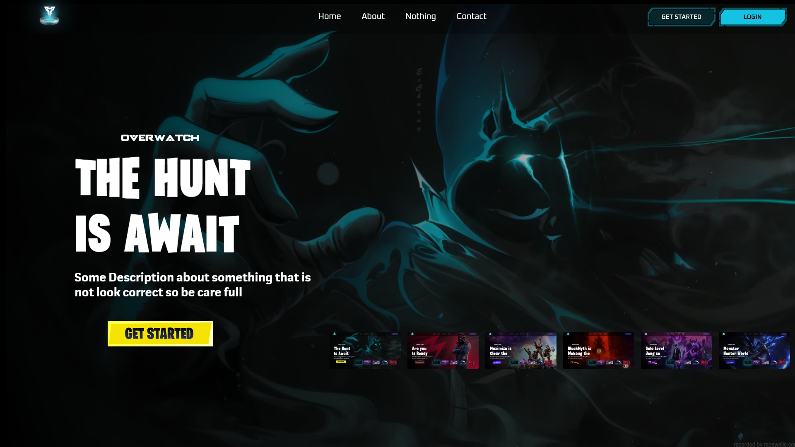 | 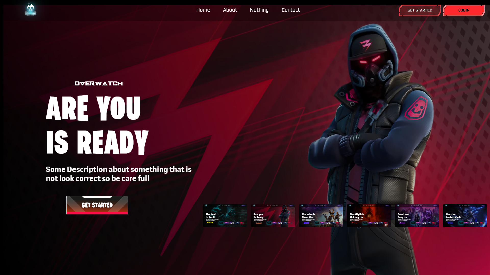 | 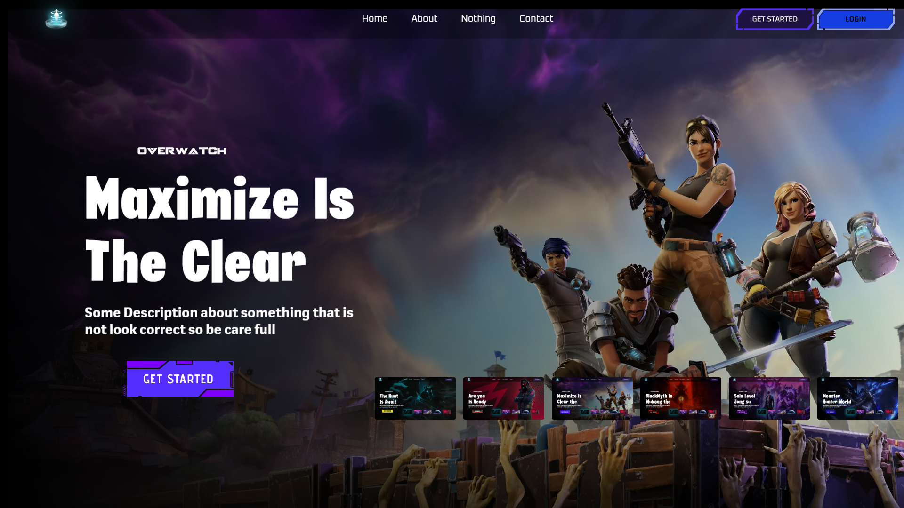 |
| ------------------------------------------------ | ------------------------------------------------ | ------------------------------------------------ |
| 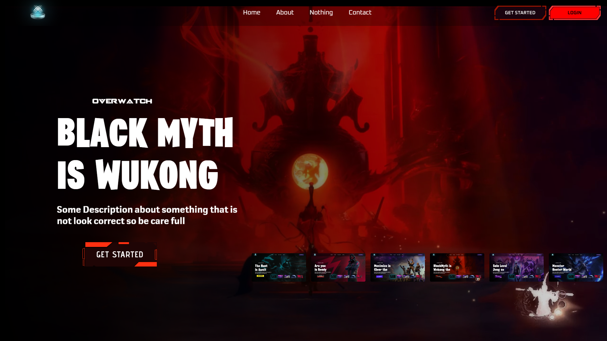 | 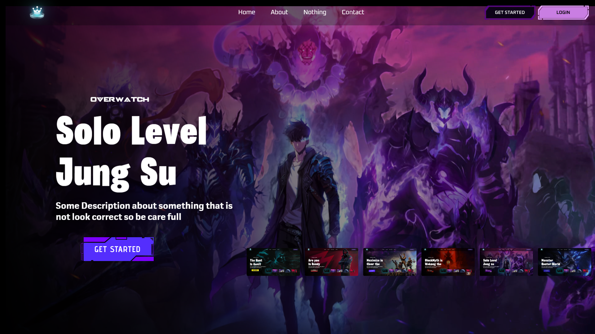 | 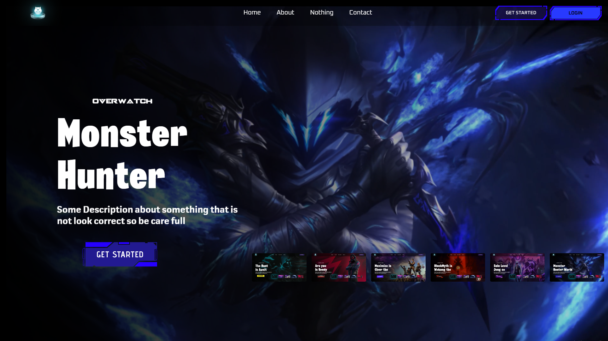 |
| 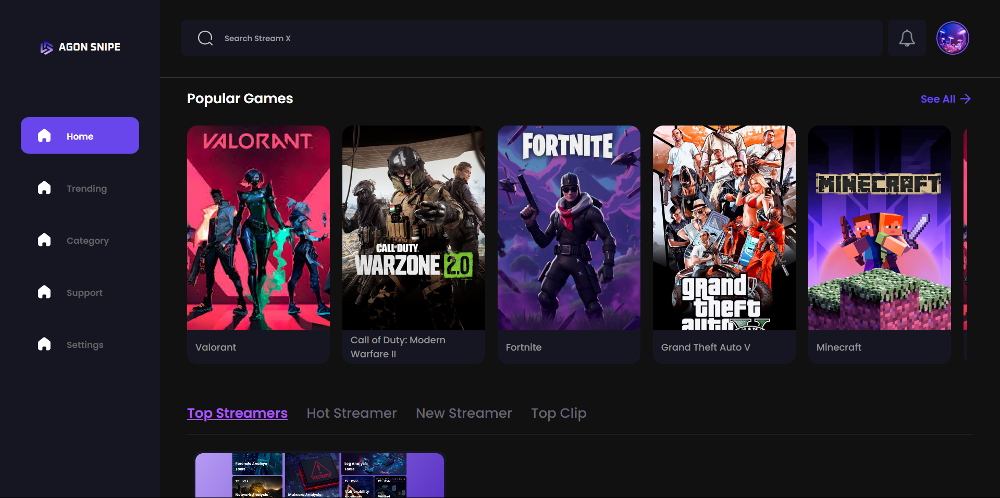 | 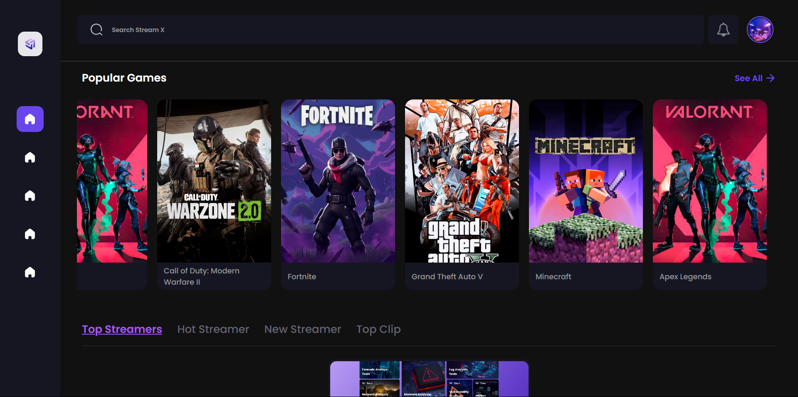 | 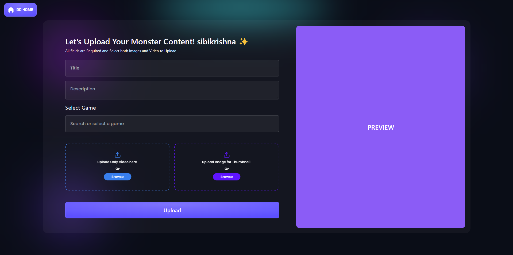 |
| 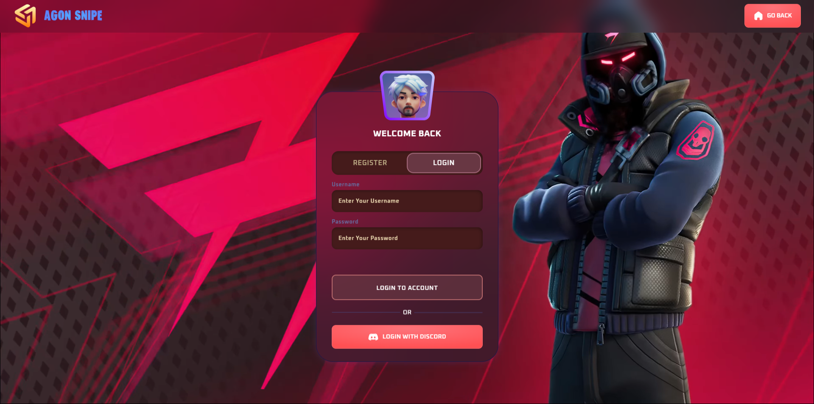 | 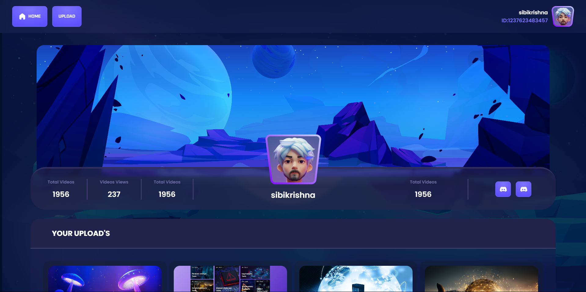 | 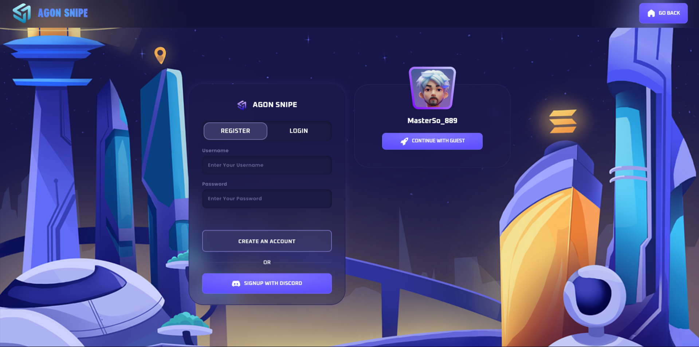 |
| 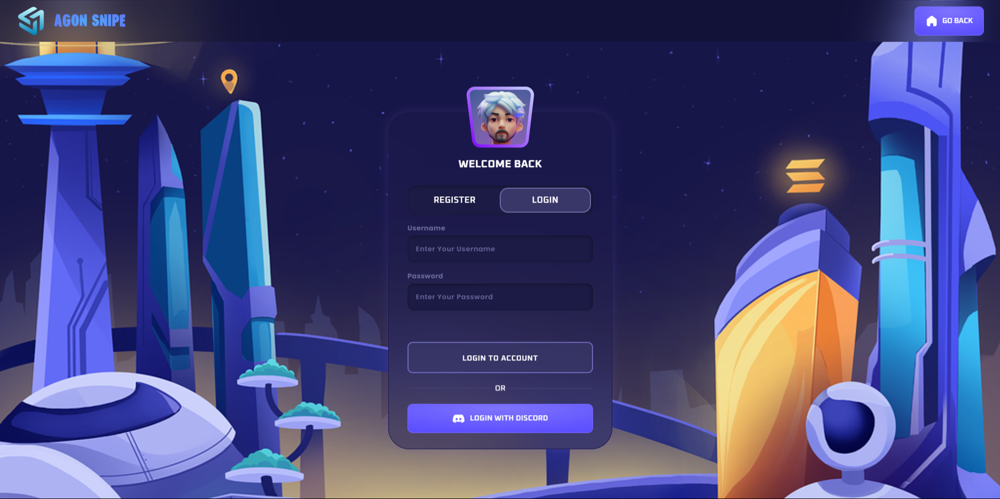 |                                                  |                                                  |

---

> [!IMPORTANT] 
> The login and registration pages draw inspiration from the sleek design seen on NeomodeonStudio's Dribbble, 
> featuring modern UI elements, clean typography, and a minimalistic form design 
> to ensure a smooth user experience.

## 🔍 Features That Will Make You Go "WOW!"

### 1. **Upload Your Videos Like a Pro 🎥**  
> [!IMPORTANT]  
> Share your favorite moments with the world. The process is simple, fast, and user-friendly.

### 2. **Explore Uploaded Content 🌍**  
> [!IMPORTANT]  
> Browse through a gallery of videos uploaded by others. Find inspiration, entertainment, or just have fun exploring.

### 3. **Responsive Design 🎮**  
> [!IMPORTANT]  
> Looks amazing on all devices — from your phone to your widescreen monitor. No compromises!

---

## 🔧 Setting Up the Fun Stuff

So you wanna get started? Follow these steps and you'll be uploading videos in no time! 🚀

1. **Clone this repo like you're cloning a Jedi 🖜:**  
   ```bash
   git clone https://github.com/Yuslash/Agon-snipe-an-stream-app-progress.git
   ```
> [!NOTE]  
> Make sure you have Git installed before cloning the repository.

2. **Navigate like a boss:**  
   ```bash
   cd Agon-snipe-an-stream-app-progress
   ```

3. **Install the goodies:**  
   ```bash
   npm install
   ```
> [!TIP]  
> Use a Node version manager like `nvm` to ensure compatibility with the required Node.js version.

4. **Fire it up:**  
   ```bash
   npm run dev
   ```
> [!IMPORTANT]  
> Open your browser and head to `http://localhost:3000` ✨.

5. **And BOOM, you're uploading videos 🎥!**  

> [!CAUTION] 
> Ensure Environment Variables  
> Double-check your `.env` file configuration before running the app to avoid errors. Missing keys can cause issues.
> 
> Keep Your Uploads Appropriate
> Videos violating community guidelines will be removed. This is a fun and safe space for everyone!  
>
> Regular Updates  
> Always pull the latest updates from the repo to ensure compatibility and bug fixes. Use:  
   ```bash
   git pull origin main
   ```

---

## 🎨 Customizing Things

Wanna make it your own? Edit the `.env` file for your config needs. Not sure what that is? It’s like setting your mood — just tweak it until it feels right. 🎧

---

## 🤜 Contributions? Heck Yeah!

This project loves contributors as much as gamers love low ping! 🎯

1. Fork the repo. (No, it’s not a real fork. 🍽️)  
2. Create a branch for your feature:  
   ```bash
   git checkout -b cool-feature
   ```  
3. Commit like a rockstar:  
   ```bash
   git commit -m 'Added some magic'
   ```  
4. Push and PR:  
   ```bash
   git push origin cool-feature
   ```  
5. Wait for your PR to be reviewed and merged. High-five incoming! 🤝  
> [!TIP]  
> Follow best practices for writing meaningful commit messages.

---

## 🔒 License

This app is open-source. Feel free to tinker, break, fix, and share it (not necessarily in that order). MIT license included because sharing is caring. 📄

---

## 🙌 Big Thanks

Special thanks to my past self for creating this awesome project solo. 🌟

---

Alright, that's enough talking. Time to upload and explore! 🚀